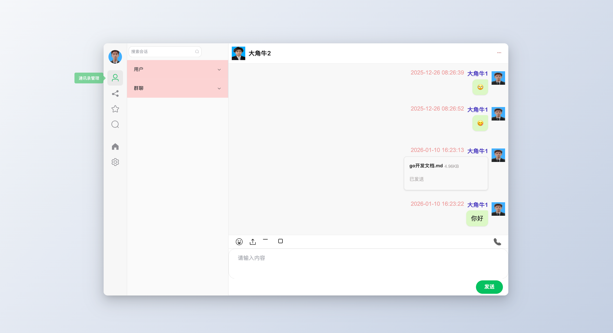
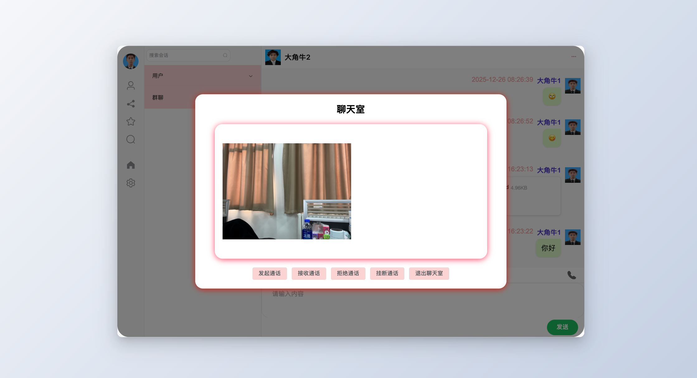

# GoChat 💬

<div align="center">

**基于 Go + Vue3 的即时通讯系统 | WebSocket + WebRTC 实时音视频**

[](https://golang.org)
[](https://vuejs.org)
[](LICENSE)

[功能特性](#-功能特性) • [快速开始](#-快速开始) • [技术架构](#-技术架构) • [项目结构](#-项目结构) • [学习路线](#-学习路线)

</div>

---

## 📖 项目简介

GoChat 是一个功能完整的即时通讯系统，实现了类似微信的核心功能。项目采用前后端分离架构，支持单聊/群聊、实时消息推送、音视频通话、文件传输等功能，适合作为学习项目或二次开发基础。



## ✨ 功能特性

### 核心功能
- 🔐 **用户系统**：注册/登录、短信验证、个人信息管理
- 💬 **即时通讯**：单聊/群聊、实时消息推送、离线消息
- 📁 **多媒体消息**：文本、图片、文件、表情
- 📞 **音视频通话**：基于 WebRTC 的 P2P 通话（支持 TURN 中继）
- 👥 **联系人管理**：添加好友、创建群组、拉黑/删除
- 🔔 **消息通知**：实时推送、未读消息提示
- 🛡️ **后台管理**：用户/群组管理、权限控制

### 技术亮点
- ✅ **分层架构**：清晰的 MVC 模式，易于维护和扩展
- ✅ **WebSocket 长连接**：实时双向通信，消息秒达
- ✅ **Redis 缓存**：消息列表缓存，减少数据库压力
- ✅ **Kafka 支持**：可选消息队列，支持高并发场景
- ✅ **离线消息**：消息持久化，上线自动拉取
- ✅ **并发安全**：Goroutine + Channel 模式，线程安全

## 🛠️ 技术栈

### 后端
| 技术 | 说明 | 版本 |
|------|------|------|
| Go | 编程语言 | 1.20+ |
| Gin | Web 框架 | Latest |
| GORM | ORM 框架 | Latest |
| MySQL | 关系型数据库 | 8.0+ |
| Redis | 缓存数据库 | 6.0+ |
| Kafka | 消息队列（可选） | Latest |
| WebSocket | 实时通信 | Gorilla |
| Zap | 日志库 | Latest |
| AES | 加密算法 | - |

### 前端
| 技术 | 说明 | 版本 |
|------|------|------|
| Vue 3 | 前端框架 | 3.0+ |
| Vue Router | 路由管理 | 4.x |
| Vuex | 状态管理 | 4.x |
| Element Plus | UI 组件库 | Latest |
| WebSocket | 实时通信 | Native |
| WebRTC | 音视频通话 | Native |
| Axios | HTTP 客户端 | Latest |

## 🚀 快速开始

### 环境要求
- Go 1.20+
- Node.js 16+
- MySQL 8.0+
- Redis 6.0+
- Git

### 本地开发

#### 1. 克隆项目
```bash
git clone https://github.com/your-username/go_chat.git
cd go_chat
```

#### 2. 后端配置

**安装依赖**
```bash
go mod tidy
```

**配置文件**
```bash
cp configs/config.toml configs/config_local.toml
```

编辑 `configs/config_local.toml`：
```toml
[mainConfig]
host = "0.0.0.0"
port = 8000

[mysqlConfig]
host = "127.0.0.1"
port = 3306
user = "root"
password = "your_password"
databaseName = "kama_chat_server"

[redisConfig]
host = "127.0.0.1"
port = 6379
password = ""
db = 0

[kafkaConfig]
messageMode = "channel"  # 本地开发使用 channel 模式
```

**创建数据库**
```bash
mysql -u root -p
CREATE DATABASE kama_chat_server CHARACTER SET utf8mb4 COLLATE utf8mb4_unicode_ci;
```

**启动服务**
```bash
# 启动 Redis
redis-server

# 启动后端
cd cmd/kama_chat_server
go run main.go
```

#### 3. 前端配置

**安装依赖**
```bash
cd web/chat-server
yarn install
# 或 npm install
```

**启动开发服务器**
```bash
yarn serve
# 或 npm run serve
```

访问 `http://localhost:8080` 即可使用。

### 常见问题

<details>
<summary><b>Q: SSL 证书问题</b></summary>

本地开发可以使用 mkcert 生成自签名证书：
```bash
# macOS
brew install mkcert
mkcert -install
mkcert 127.0.0.1 localhost

# 将生成的证书放到 pkg/ssl/ 目录
```

或修改 `cmd/kama_chat_server/main.go` 使用 HTTP：
```go
if err := https_server.GE.Run(fmt.Sprintf("%s:%d", host, port)); err != nil {
    zlog.Fatal("server running fault")
}
```
</details>

<details>
<summary><b>Q: 数据库连接失败</b></summary>

检查 MySQL 是否启动：
```bash
# macOS/Linux
sudo service mysql status

# Windows
net start mysql
```
</details>

<details>
<summary><b>Q: Redis 连接失败</b></summary>

检查 Redis 是否启动：
```bash
redis-cli ping
# 返回 PONG 表示正常
```
</details>

## 🏗️ 技术架构

### 系统架构图
```
┌─────────────────────────────────────────────────────────────┐
│                         前端 (Vue3)                          │
│  ┌──────────┐  ┌──────────┐  ┌──────────┐  ┌──────────┐   │
│  │ 登录注册 │  │ 聊天界面 │  │ 联系人   │  │ 后台管理 │   │
│  └──────────┘  └──────────┘  └──────────┘  └──────────┘   │
└────────────────────┬────────────────────────────────────────┘
                     │ HTTP/WebSocket/WebRTC
┌────────────────────┴────────────────────────────────────────┐
│                      后端 (Go + Gin)                         │
│  ┌──────────┐  ┌──────────┐  ┌──────────┐  ┌──────────┐   │
│  │ API 层   │  │ Service  │  │ DAO 层   │  │ Model 层 │   │
│  └──────────┘  └──────────┘  └──────────┘  └──────────┘   │
└────────────────────┬────────────────────────────────────────┘
                     │
┌────────────────────┴────────────────────────────────────────┐
│                      数据存储层                              │
│  ┌──────────┐  ┌──────────┐  ┌──────────┐                  │
│  │  MySQL   │  │  Redis   │  │  Kafka   │                  │
│  └──────────┘  └──────────┘  └──────────┘                  │
└─────────────────────────────────────────────────────────────┘
```

### WebSocket 消息流程
```
用户 A 发送消息
    ↓
WebSocket Client
    ↓
后端 WS Controller
    ↓
Chat Server (Transmit Channel)
    ↓
├─ 存储到 MySQL (持久化)
├─ 缓存到 Redis (加速查询)
└─ 转发给接收者
    ↓
WebSocket Client
    ↓
用户 B 接收消息
```

### WebRTC 通话流程
```
用户 A 发起通话
    ↓
创建 RTCPeerConnection
    ↓
生成 Offer SDP
    ↓
通过 WebSocket 发送 Offer
    ↓
后端转发给用户 B
    ↓
用户 B 创建 RTCPeerConnection
    ↓
生成 Answer SDP
    ↓
通过 WebSocket 发送 Answer
    ↓
交换 ICE Candidates
    ↓
建立 P2P 连接
    ↓
音视频流传输
```

## 📁 项目结构

### 后端结构
```
go_chat/
├── api/v1/                    # API 接口层（Controller）
│   ├── user_info_controller.go
│   ├── message_controller.go
│   ├── group_info_controller.go
│   └── ws_controller.go
├── cmd/kama_chat_server/      # 应用入口
│   └── main.go
├── internal/                  # 内部代码
│   ├── config/                # 配置管理
│   ├── dao/                   # 数据访问层
│   ├── dto/                   # 数据传输对象
│   │   ├── request/           # 请求结构体
│   │   └── respond/           # 响应结构体
│   ├── model/                 # 数据模型
│   │   ├── user_info.go
│   │   ├── message.go
│   │   └── group_info.go
│   └── service/               # 业务逻辑层
│       ├── chat/              # WebSocket 聊天服务
│       ├── gorm/              # 数据库业务
│       ├── redis/             # Redis 缓存
│       └── kafka/             # Kafka 消息队列
├── pkg/                       # 公共代码
│   ├── constants/             # 常量定义
│   ├── enum/                  # 枚举类型
│   ├── util/                  # 工具函数
│   └── zlog/                  # 日志管理
└── configs/                   # 配置文件
```

### 前端结构
```
web/chat-server/
├── src/
│   ├── main.js                # 入口文件
│   ├── App.vue                # 根组件
│   ├── components/            # 公共组件
│   │   ├── Modal.vue
│   │   └── VideoModal.vue
│   ├── router/                # 路由配置
│   ├── store/                 # Vuex 状态管理
│   └── views/                 # 页面视图
│       ├── access/            # 登录注册
│       ├── chat/              # 聊天模块
│       │   ├── contact/       # 联系人
│       │   ├── session/       # 会话列表
│       │   └── user/          # 个人中心
│       └── manager/           # 后台管理
└── package.json
```

## 📚 数据库设计

### 核心表结构

**user_info（用户表）**
- uuid: 用户唯一标识
- nickname: 昵称
- telephone: 手机号
- password: 密码（AES 加密）
- avatar: 头像 URL
- is_admin: 是否管理员

**message（消息表）**
- uuid: 消息唯一标识
- session_id: 所属会话
- type: 消息类型（0:文本, 1:文件, 2:音视频）
- content: 消息内容
- send_id: 发送者 UUID
- receive_id: 接收者 UUID
- av_data: WebRTC 信令数据

**group_info（群组表）**
- uuid: 群组唯一标识
- name: 群名称
- owner_id: 群主 UUID
- members: 成员列表（JSON）
- add_mode: 加群方式（0:直接, 1:审核）

**session（会话表）**
- uuid: 会话唯一标识
- send_id: 创建者 UUID
- receive_id: 对方 UUID
- last_message: 最后一条消息

**user_contact（联系人关系表）**
- user_id: 用户 UUID
- contact_id: 联系人 UUID
- status: 状态（0:正常, 1:拉黑）

**contact_apply（好友申请表）**
- apply_user_id: 申请人 UUID
- receive_user_id: 接收人 UUID
- status: 状态（0:待处理, 1:已同意, 2:已拒绝）

## 🎓 学习路线

### 适合人群
- Go 后端开发学习者
- Vue 前端开发学习者
- 想了解即时通讯系统实现原理的开发者
- 需要毕设/课设项目参考的学生

### 学习顺序

#### 阶段一：环境搭建（1天）
1. 安装 Go、Node.js、MySQL、Redis
2. 克隆项目并配置
3. 启动项目，注册测试账号

#### 阶段二：数据库与模型层（2天）
1. 理解 6 张核心表的设计
2. 学习 GORM 模型定义
3. 理解软删除、索引、关联关系

#### 阶段三：用户模块（3天）
1. 注册流程：密码加密、UUID 生成
2. 登录流程：密码验证、返回用户信息
3. 短信验证：阿里云短信服务集成

#### 阶段四：WebSocket 实时通信（5天，核心）
1. WebSocket 连接建立
2. Chat Server 架构（Login/Logout/Transmit Channel）
3. 消息收发流程
4. 离线消息处理

#### 阶段五：联系人与群组（3天）
1. 好友申请流程
2. 群组创建与管理
3. 会话列表管理

#### 阶段六：消息管理（2天）
1. 消息列表查询
2. Redis 缓存策略
3. 文件上传处理

#### 阶段七：WebRTC 音视频（4天，难点）
1. WebRTC 基础概念
2. SDP Offer/Answer 交换
3. ICE Candidate 交换
4. TURN 服务器配置

#### 阶段八：后台管理（2天）
1. 管理员权限控制
2. 用户/群组管理功能

#### 阶段九：项目部署（3天）
1. Ubuntu 服务器部署
2. HTTPS 配置
3. TURN 服务器部署

### 学习建议

1. **循序渐进**：从单个功能模块入手，跟踪完整流程
2. **边学边做**：修改代码观察效果，加深理解
3. **调试技巧**：
   - 后端：使用 `zlog.Info()` 打印日志
   - 前端：使用 `console.log()` 查看数据
   - 数据库：使用 MySQL Workbench 查看数据
   - Redis：使用 Redis Desktop Manager 查看缓存

4. **扩展练习**：
   - 添加表情包功能
   - 实现消息撤回
   - 添加消息已读/未读状态
   - 实现群组管理员功能

## 📖 参考文档

- [Gin 官方文档](https://gin-gonic.com/)
- [GORM 官方文档](https://gorm.io/)
- [Vue3 官方文档](https://cn.vuejs.org/)
- [WebRTC 教程](https://webrtc.org/)
- [项目详细文档](docs/业务逻辑.md)

## 🔮 TODO

- [ ] 多对多群聊优化
- [ ] Nginx 分布式部署
- [ ] 消息已读/未读状态
- [ ] 消息撤回功能
- [ ] 群组管理员权限
- [ ] 表情包支持

## 📄 License

本项目采用 MIT 协议开源，详见 [LICENSE](LICENSE) 文件。

## 🤝 贡献

欢迎提交 Issue 和 Pull Request！

---

<div align="center">

**如果这个项目对你有帮助，请给个 ⭐️ Star 支持一下！**

Made with ❤️ by GoChat Team

</div>
